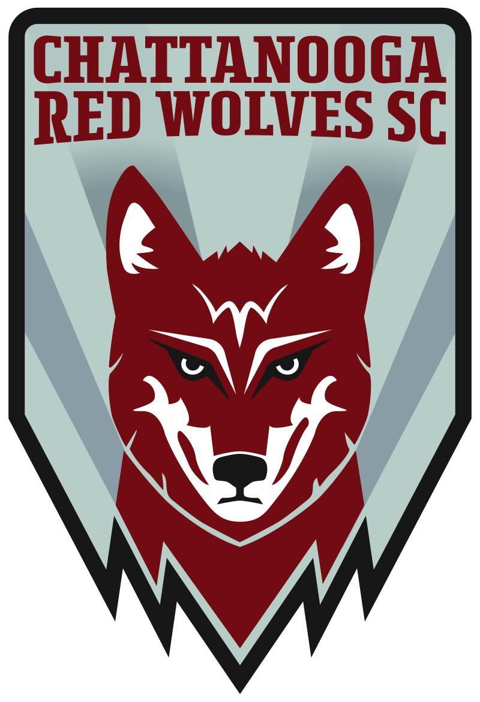
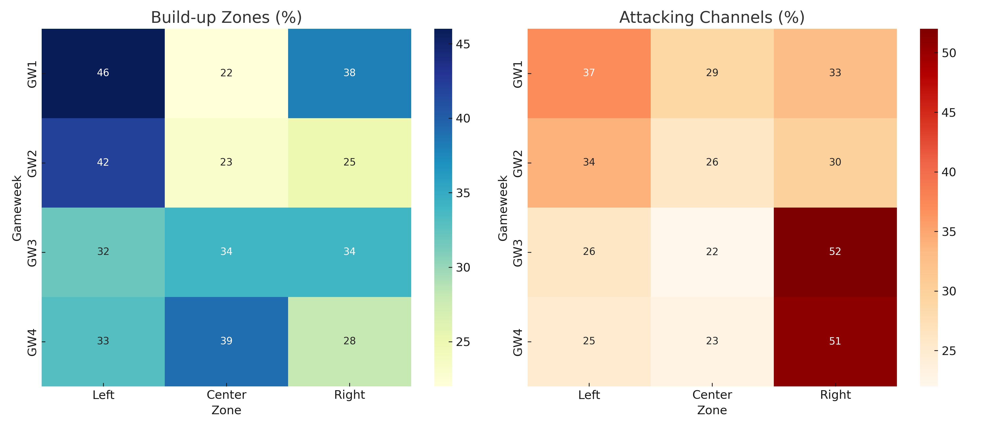
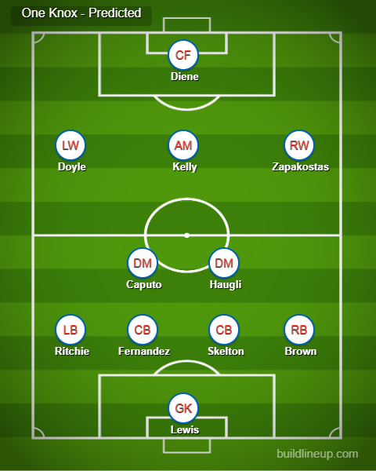

# One Knox Tendency Report

## Scouting Matchup: Chattanooga Red Wolves 🆚 One Knoxville SC

  
  &nbsp;&nbsp;&nbsp;&nbsp;
  

📊 A visual scouting report on **One Knoxville SC**'s build-up and attacking tendencies from the last 4 games (as of 7/20) of the 2025 USL League One season.

## 🔍 Scouting Process

This project was created by manually tracking tactical tendencies from match film and visualizing them for coaching analysis. The process included:

- Watching 4 full matches via **ESPN+**
- Tracking build-up and final third attacking zones (Left, Center, Right)
- Tracking mode of attack, play style, individual performance, distribution
- Free kick takers and tendencies
- Cross-checking observations with **FBref**
- Creating visual heatmaps using **Python**, **pandas**, **seaborn**, and **matplotlib**

## 📈 Final Graphic

📅 Match Sample – Tactical Analysis Based on 2025 Fixtures  
This report is based on full-match scouting of the following four One Knoxville SC matches:
- July 5 @ Chattanooga (0-1 L) – “GW 1”
- July 12 @ Tormenta (2-1 W) – “GW 2”
- July 16 vs. AV Alta FC (3-1 W) – “GW 3”
- July 19 vs. Westchester SC (1-1 D) – “GW 4”

These matches were selected to reflect recent team form, consistent lineup selections, and opposing variety (home and away).

The heatmaps show:
- **Build-up Zones (%):** Where One Knox initiates play
- **Attacking Channels (%):** Where final third entries and attacks occur

### 🔢 Predicted Lineup: One Knoxville SC

*Predicted starting XI based on last 4 matches. Formation: 4-2-3-1 with double pivot (Caputo & Haugli) and Kelly operating centrally beneath Diene.*

---

### 📄 Full PDF Report

📥 [Download the full written scouting report](docs/One_Knox_Tendencies_Summary.pdf)  
Includes deeper tactical tendencies, set piece analysis, transition behaviors, and a match-by-match breakdown.

---
Absolutely — here’s a **more data-driven** version of the predicted scoreline section. It still includes your tactical reasoning but grounds it in recent performance trends and game traits:

---

## 🔮 Predicted Scoreline

**Chattanooga Red Wolves 2 - 1 One Knoxville SC**

This Tennessee Derby is expected to be a tightly contested match, but Chattanooga holds the edge based on recent form and tactical matchups:

* **Defensive Solidity:** Chattanooga has conceded just *3 goals across their last 4 matches*, often forcing opponents into wide areas and low-percentage shots. Their narrow mid-block limits central penetration—precisely where One Knox struggles to create.

* **Exploiting Forced Play:** One Knoxville prefers a possession-first, defense-to-attack build-up model. However, when trailing, they tend to force chances—leading to turnovers and exposure in transition. Chattanooga has shown they can punish these moments with **direct attacking transitions** and set piece efficiency.

* **Efficiency in Attack:** The Red Wolves average **1.4 goals per game over their last 5 matches**, and often convert a high proportion of their big chances. Against a One Knox side that can overcommit, this may prove decisive.

* **Home Field & Momentum:** Chattanooga is unbeaten at home in 3 straight matches and enters with momentum following a hard-earned draw vs top opposition.

> 📊 **Prediction:** Chattanooga will frustrate One Knox’s build-up, strike on the counter, and edge out a 2–1 win.

---

## 🛠 Tools Used

- Python 3
- pandas
- seaborn
- matplotlib

## 📁 Files Included

- `graphics/One-Knox-Tendency-Graphic.png` – Final report graphic
- `graphics/lineup.png` – Predicted starting XI for One Knoxville SC
- `graphics/Red-Wolves-SC-logo.png` – Chattanooga Red Wolves logo
- `graphics/one-knox-logo.png` – One Knoxville SC logo
- `docs/One_Knox_Tendencies_Summary.pdf` – Full written opposition report
- `one_knox_tendency_graphic.py` – Python script to generate the visuals

## 🧠 About This Project

This report was produced as part of a scouting and data analysis initiative. The intent was to provide usable visuals for match prep and tactical planning.

Feedback and suggestions are always welcome.
